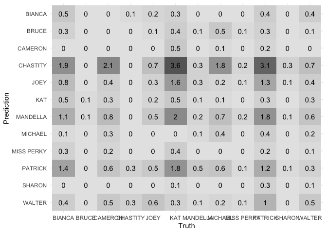
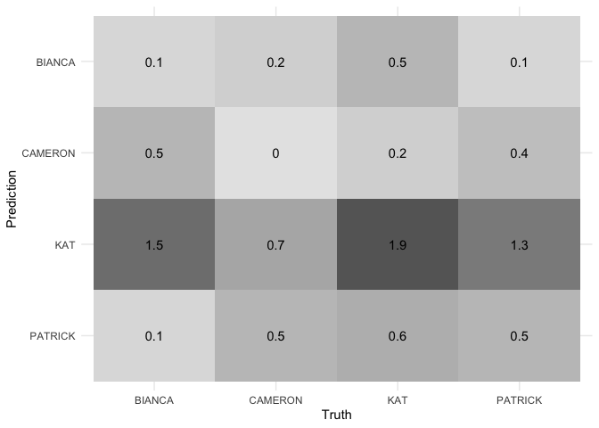

Character Speaking Predictions
================
Georgianna James
2022-03-13

# Intro

In this file I attempt to predict characters based on their lines. First
I perform these predictions using a random forest on all of the
character data. Then, I repeat the same predictions using the four main
characters.

# Set Up

## Required Packages

``` r
library(tidyverse)
library(tidymodels)
library(stringr)
library(textrecipes)
library(themis)
library(vip)
library(here)
library(stopwords)
library(knitr)

# set seed for randomization
set.seed(123)
theme_set(theme_minimal())
```

## Load, Tidy, and Merge Data

``` r
# load line data

movie_lines <- read_csv(here("data", "movie_lines.tsv"), col_names=FALSE)

movie_lines <- movie_lines %>% 
  separate(X1, into = c('lineID', 'charID', 'movieID', 'charName', 'text'), sep = '\t')

# load title data

movie_titles <- read_csv(here("data", "movie_titles_metadata.tsv"), col_names=FALSE)


movie_titles <- movie_titles %>% 
    separate(X1, into = c('movieID', 'title', 'year', 'ratingIMDB', 'votes', 'genresIMDB'), sep = '\t')

# combine data and create a data frame for 10 Things I Hate About You 

ten_things_characters <- movie_lines %>% 
  left_join(movie_titles, by = 'movieID') %>% 
  filter(movieID == "m0")
```

# Process Data for Modeling

``` r
# split into training/testing
ten_things_characters_split <- initial_split(data = ten_things_characters, strata = charName, prop = 3/4)

ten_things_characters_train <- training(ten_things_characters_split)
ten_things_characters_test <- testing(ten_things_characters_split)

# create cross-validation folds
ten_things_characters_folds <- vfold_cv(data = ten_things_characters_train, strata = charName)
```

``` r
# define the recipe
ten_things_characters_rec <- recipe(charName ~ text, data = ten_things_characters_train) %>% 
    step_tokenize(text) %>% # tokenize the lines by words
  step_stopwords(text) %>% # remove stop words 
  step_tokenfilter(text, max_tokens = 500) %>% #select top 500 tokens 
  step_tfidf(text) %>% # edit token to depict just the actual token
          step_rename_at(starts_with("tfidf_text_"),
          fn = ~ str_replace_all(
            string = .,
            pattern = "tfidf_text_",
            replacement = ""
          )
        ) %>% 
  step_downsample(charName)
```

``` r
# define the model specification (using random forest)
ranger_model <- rand_forest(trees = 500) %>%
  set_mode("classification") %>%
  set_engine("ranger")

# define the workflow
ranger_workflow <- workflow() %>%
  add_recipe(ten_things_characters_rec) %>%
  add_model(ranger_model)

# fit the model to each of the cross-validation folds
ranger_cv <- ranger_workflow %>%
  fit_resamples(
  ten_things_characters_folds,
  control = control_resamples(save_pred = TRUE)
)
```

# Perform Predictions

``` r
# extract metrics and predictions
ranger_cv_metrics <- collect_metrics(ranger_cv)
ranger_cv_predictions <- collect_predictions(ranger_cv)
```

## Metrics table

| Metric   | Estimator  |      Mean |   n | Standard Error | Configuration        |
|:---------|:-----------|----------:|----:|---------------:|:---------------------|
| accuracy | multiclass | 0.0719992 |  10 |      0.0158442 | Preprocessor1_Model1 |
| roc_auc  | hand_till  | 0.5106359 |  10 |      0.0087240 | Preprocessor1_Model1 |

### Interpretation

These are very inaccurate predictions, with an average accuracy of
around 7%. Let’s visualize the results to get a sense of why this is
such a poor performing model.

## Confusion Matrix

``` r
# create a confusion matrix to visualize performance 

conf_mat_resampled(x = ranger_cv, tidy = FALSE) %>%
  autoplot(type = "heatmap")
```

<!-- -->

### Interpretation

It looks like the lines of Bianca, Cameron, Kat, and Patrick are very
frequently being inaccurately predicted. This, however, is likely
because there are many more lines for these characters than any others,
so there is more opportunity to incorrectly predict their lines. The
table below reveals the disparity of lines between characters.

## Number of Lines Per Character

| Character Name | Number of Lines |
|:---------------|----------------:|
| KAT            |             155 |
| PATRICK        |             140 |
| BIANCA         |              98 |
| CAMERON        |              78 |
| MICHAEL        |              62 |
| WALTER         |              42 |
| JOEY           |              37 |
| MANDELLA       |              25 |
| MISS PERKY     |              12 |
| SHARON         |               9 |
| CHASTITY       |               8 |
| BRUCE          |               3 |

# Performing Character Predictions Filtering for Four Main Characters

``` r
# create main characters data set 

main_characters <- ten_things_characters %>% 
  filter(charName == c("BIANCA", "CAMERON", "KAT", "PATRICK"))
```

# Process Data for Modeling

``` r
# split into training/testing
main_characters_split <- initial_split(data = main_characters, strata = charName, prop = 3/4)

main_characters_train <- training(main_characters_split)
main_characters_test <- testing(main_characters_split)

# create cross-validation folds
main_characters_folds <- vfold_cv(data = main_characters_train, strata = charName)
```

``` r
# define recipe
main_characters_rec <- recipe(charName ~ text, data = main_characters_train) %>% 
    step_tokenize(text) %>%
  step_stopwords(text) %>%
  step_tfidf(text) %>%
          step_rename_at(starts_with("tfidf_text_"),
          fn = ~ str_replace_all(
            string = .,
            pattern = "tfidf_text_",
            replacement = ""
          )
        ) %>% 
  step_downsample(charName)
```

``` r
# define the model specification
ranger_model <- rand_forest(trees = 1000) %>%
  set_mode("classification") %>%
  set_engine("ranger")

# define the workflow
ranger_workflow <- workflow() %>%
  add_recipe(main_characters_rec) %>%
  add_model(ranger_model)

# fit the model to each of the cross-validation folds
ranger_cv <- ranger_workflow %>%
  fit_resamples(
  main_characters_folds,
  control = control_resamples(save_pred = TRUE)
)
```

# Make Predictions

``` r
# extract metrics and predictions
ranger_cv_metrics <- collect_metrics(ranger_cv)
ranger_cv_predictions <- collect_predictions(ranger_cv)
```

## Metrics table

| Metric   | Estimator  |      Mean |   n | Standard Error | Configuration        |
|:---------|:-----------|----------:|----:|---------------:|:---------------------|
| accuracy | multiclass | 0.2727778 |  10 |      0.0430845 | Preprocessor1_Model1 |
| roc_auc  | hand_till  | 0.5000000 |  10 |      0.0258597 | Preprocessor1_Model1 |

### Interpretation

While 26% accuracy is still not very high, filtering for only the main
characters made for a much more accurate model. Let’s visualize these
results to see which character was associated with the most accurate
predictions.

## Confusion Matrix

``` r
# confusion matrix
conf_mat_resampled(x = ranger_cv, tidy = FALSE) %>%
  autoplot(type = "heatmap")
```

<!-- -->

### Interpretation

It looks like Kat was the most often correctly predicted. However, it
also looks like the model predicted that the other three main
characters’ lines were Kat very frequently. This is likely because Kat
had the most lines. The table below ranks the main characters in terms
of number of lines.

## Number of Lines Per Main Character

| Character Names | Number of Lines |
|:----------------|----------------:|
| KAT             |              43 |
| PATRICK         |              31 |
| BIANCA          |              30 |
| CAMERON         |              19 |

# Conclusion

Predicting the speaker of lines from 10 Things I Hate About You using a
random forest model is over all pretty inaccurate. Some of the
inaccuracy comes from the disparity in number of lines between
characters. However, even when you look at just the main characters,
accuracy only increases to around 30%. I think the inaccuracy is due to
two main reasons. Firstly, this a pretty small data set for machine
learning purposes. Secondly, the nature of the script does not
necessarily lend to the predictions I am trying to make. The characters
on average talk about very similar topics throughout, making it hard to
differentiate between them.
