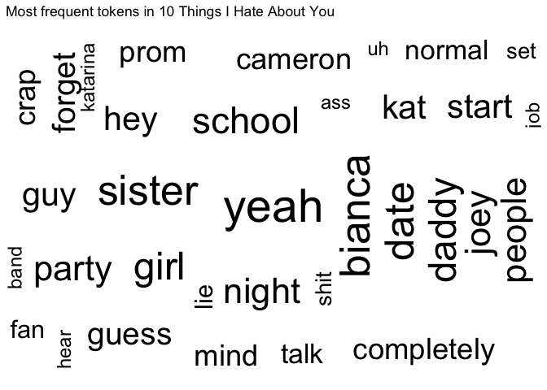
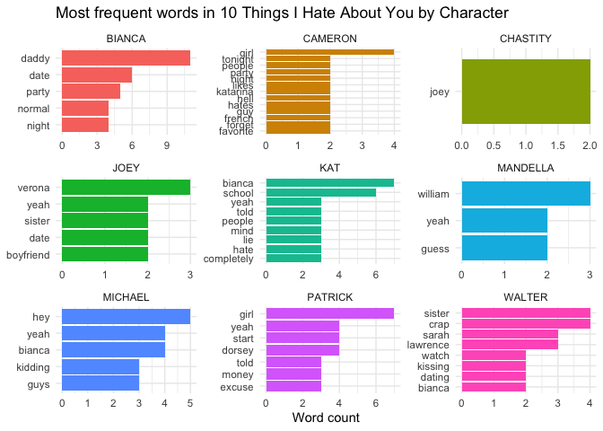
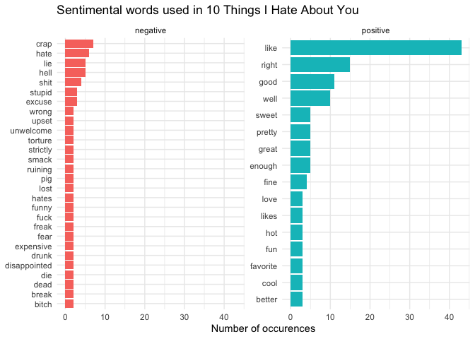
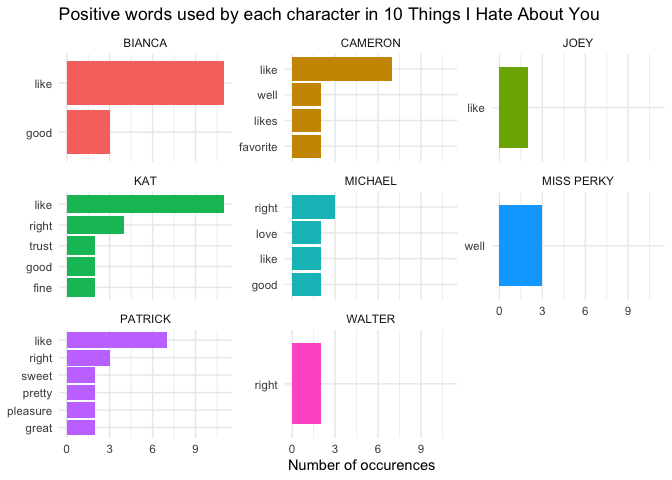
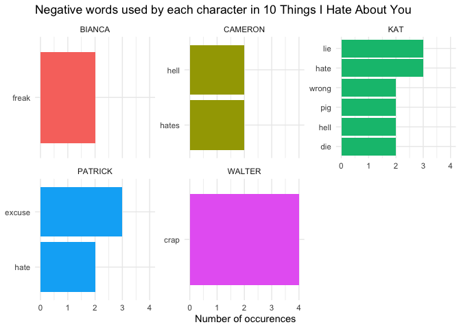
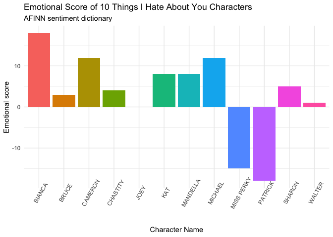
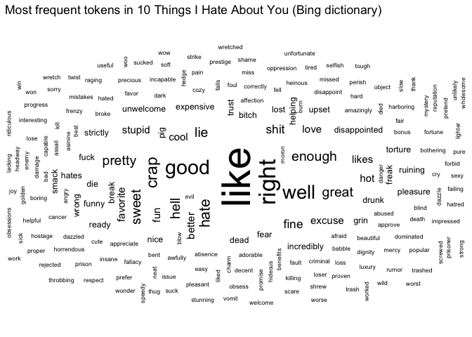
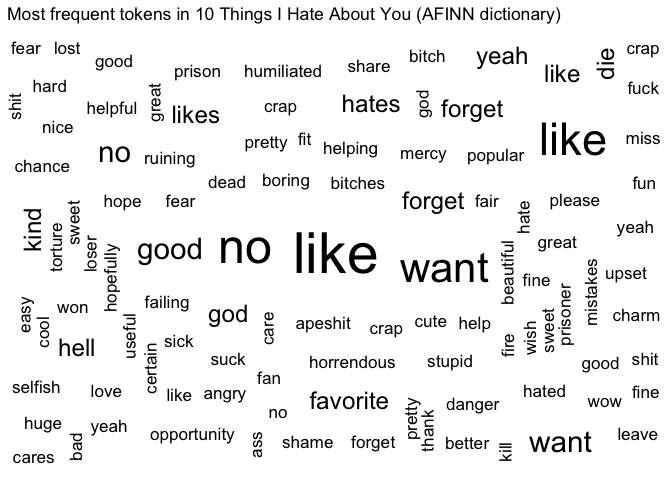

10 Things I Hate About You Sentiment Analysis
================
Georgianna James
2022-03-13

# Intro

In this file, I conduct a text analysis of the scrip 10 Things I Hate
About You. First, I investigate which words were most frequently used
throughout the film and by which characters. Then, I analyze the data
for sentiment using the Bing dictionary and the AFFIN dictionary.

# Set Up

## Required Packages

``` r
library(tidyverse)
library(tidytext)
library(textdata)
library(ggwordcloud)
library(here)


theme_set(theme_minimal())

set.seed(123)
```

## Load and tidy data

``` r
# load the data set for each line 
movie_lines <- read_csv(here("data", "movie_lines.tsv"), col_names=FALSE)

movie_lines <- movie_lines %>% 
  separate(X1, into = c('lineID', 'charID', 'movieID', 'charName', 'text'), sep = '\t')

# load the data for titles in order to select for the film I am analyzing

movie_titles <- read_csv(here("data", "movie_titles_metadata.tsv"), col_names=FALSE)


movie_titles <- movie_titles %>% 
    separate(X1, into = c('movieID', 'title', 'year', 'ratingIMDB', 'votes', 'genresIMDB'), sep = '\t')

# create a data frame for the film 10 Things I Hate About You
ten_things_lines <- movie_lines %>% 
  left_join(movie_titles, by = 'movieID') %>% 
  filter(movieID == "m0") %>% 
  select(charName, text) 


# tokenize by word
ten_things_lines <- unnest_tokens(
  tbl = ten_things_lines,
  output = word,
  input = text
)
```

# Text Analysis

## What are the most frequently used words in the film?

<!-- -->

## Summary

One can conclude from the above word plot that 10 Things I Hate About
You is a romantic movie about sisters in high school who are primarily
intersted in stereotypical teenage priorities like dates, prom, and
parties. This observation is pretty accurate to the real plot of the
movie.

## What are the most frequently used words in the film by each character?

<!-- -->

## Summary

If you are familiar with the plot of 10 Things I Hate About You, you
might find that the second plot is even more telling than the first.
From analyzing the visualization above, you find that, true to the plot
of the film, Bianca does a lot of talking to her ‘daddy’ and about dates
and parties and being a normal girl; Joey talks a lot about dating
someone’s sister; Kat talks a lot about Bianca and school. Additionally,
‘money’ shows up on Patrick’s plot, revealing a crucial plot point (that
Patrick is paid to ask Kat out on a date).

## Sentiment Analysis Using Bing Dictionary

``` r
#load the bing dictionary and join by word 

ten_things_bing <- ten_things_lines %>%
  inner_join(get_sentiments("bing"))
```

## What are the most frequently used positive and negative words?

<!-- -->

## Summary

It’s no surprise that ‘hate’ is high on the list of frequently used
negative words, given it’s in the title of the film, followed by ‘lie,’
which is also an important plot point. On the positive graph, the token
‘like’ is the most frequently used positive word in the film. However,
as those who are familiar with teen rom-coms from the late ‘90s might
recall, ’like’ is very commonly used as a filler word, in addition to
the literal usage of the term, but I’ve chosen to keep it because I know
‘like’ is also important to the plot.

## What are the most frequently used positive and negative words by each character?

<!-- -->
<!-- -->

## Summary

Kat uses many more negative and positive words than any other character,
suggeting that she is the protagonist (which she is). Other characters
that use a lot of sentimental words are Cameron and Patrick, who are
also main characters.

## Sentiment Analysis

### Using AFINN Dictionary

``` r
#load the AFINN dictionary and join by word 

ten_things_afinn <- ten_things_lines %>%
  inner_join(get_sentiments("afinn")) %>%
  group_by(charName)
```

## What is the emotional score of each character in 10 Things I Hate About You?

<!-- -->

## Summary

From the plot of emotional scores, you find that Bianca displays the
most positivity in her lines, while Patrick the most negative. Both
findings make sense in the context of the plot, as Bianca pretty much
only talks about parties and dating the whole film, while Patrick is the
‘bad boy’ of the movie, which lends to a lower emotional score.

## What are the most frequent sentimental tokens used in the film (for both the Bing dictionary and the AFFIN dictionary)

<!-- -->
<!-- -->

# Conclusion

Analyzing the script of 10 Things I Hate About You for sentiment allows
you to pick up on some important plot information. For example, the
results revealed that the film is generally about sisters, high school,
dating, partying and prom. Breaking the analysis down by character, you
can see that Kat has a lot of both positive and negative lines, but
averages out to be a positive character, suggesting that she is a main
character with a positive ending (which is pretty accurate), while
Patrick scores the most negative, capturing the bad boy attitude of the
character Patrick. While text analysis of a movie script allows you to
pick up on trends that can be captured in words, you are also limited to
sentiment that can be captured in text. For example, in this analysis,
Bianca is depicted as a very positive character who mostly talks about
parties and dating. However, those who are familiar with this film may
be surprised to find that this character scores the highest on the
emotional scale from the AFINN dictionary, as she might not come off as
positively as her lines depict. This is likely because text analysis
does not pick up on the way characters deliver lines. However, we were
able to glean a lot of information about the emotional landscape of the
film regardless.
