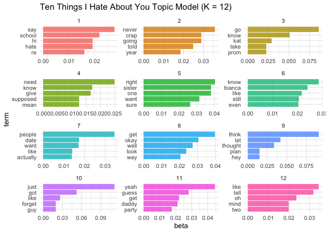
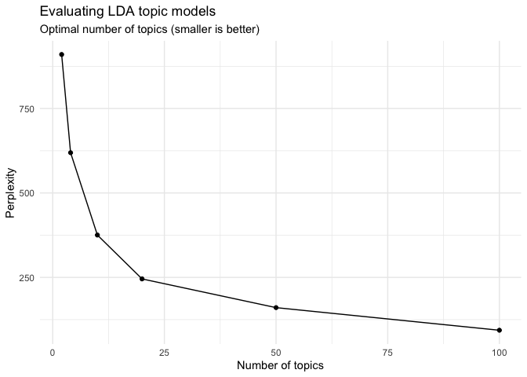

10 Things I Hate About You Topic Modeling
================
Georgianna James
2022-03-11

# Intro

In this file, I analyze the script of 10 Things I Hate About You for
topic using Latent Dirichlet allocation.

# Set Up

## Required Packages

``` r
library(tidyverse)
library(readr)
library(here)
library(tidymodels)
library(tidytext)
library(textrecipes)
library(topicmodels)
library(tm)
library(tictoc)

theme_set(theme_minimal())
```

## Load, Clean, and Merge Data

``` r
# load and tidy lines data set 

movie_lines <- read_csv(here("data", "movie_lines.tsv"), col_names=FALSE)

movie_lines <- movie_lines %>% 
  separate(X1, into = c('lineID', 'charID', 'movieID', 'charName', 'text'), sep = '\t')

# load and tidy titles data set 

movie_titles <- read_csv(here("data", "movie_titles_metadata.tsv"), col_names=FALSE)

movie_titles <- movie_titles %>% 
    separate(X1, into = c('movieID', 'title', 'year', 'ratingIMDB', 'votes', 'genresIMDB'), sep = '\t')

# combine data and filter for 10 Things I Hate About You

ten_things <- movie_lines %>% 
  left_join(movie_titles, by = 'movieID') %>% 
  filter(movieID == "m0") %>% 
  select(lineID, text)
```

# Top Modeling

## Prepare data for estimating the model

### Create a recipe

``` r
set.seed(123)

# initialize recipe using the movie lines from 1999
ten_things_recipe <- recipe(~., data = ten_things) %>% 
# tokenize the text data by indivual words
  step_tokenize(text) %>% 
# remove common stop words
  step_stopwords(text) %>% 
# calculate the n-gram with all possible 1-5-grams  
  step_ngram(text, num_tokens = 5, min_num_tokens = 1) %>%
# keep the most popular 2000
  step_tokenfilter(text, max_tokens = 2000) %>%
# calculate the term-frequency for each unique term in each line  
  step_tf(text)
```

### Prep the recipe

Here, the resulting data frame consists of one row per line and one
column per joke (in addition to the original variables).

``` r
ten_things_prep <- prep(ten_things_recipe)

ten_things_df <- bake(ten_things_prep, new_data = NULL)
```

### Convert to tidytext format and covert to DocumentTermMatrix format

``` r
ten_things_dtm <- ten_things_df %>%
# combine all tokens into a token column and a column for their values
  pivot_longer(
    cols = -lineID,
    names_to = "token",
    values_to = "n"
  ) %>%
  filter(n != 0) %>%
  mutate(
  # clean token column
    token = str_remove(string = token, pattern = "tf_text_"),
  # drop empty levels from lineID 
    lineID = fct_drop(f = lineID)
  ) %>%
  # convert ot a DTM
  cast_dtm(document = lineID, term = token, value = n)
```

# Model topics using LDA

## K = 12

First, I conduct the topic modeling assuming that there are 12 topics.

``` r
ten_things_lda12 <- LDA(ten_things_dtm, k = 12, control = list(seed = 123))
```

<!-- -->

### Interpretation:

If you are a fan of 10 Things I Hate About You, you might be able to
tease out some familiar topics from the movie. To an audience who hasn’t
seen the film, it’s a little less clear. It looks like someone is saying
hi at school, someone wants to take Kat to prom, Bianca likes someone…

Let’s look into the optimal number of topics for this script by
conducting a perplexity analysis.

# Perplexity Analysis

``` r
n_topics <- c(2, 4, 10, 20, 50, 100)

# cache the models and only estimate if they don't already exist
if (file.exists(here("data", "ten_things_lda_compare.Rdata"))) {
  load(file = here("data", "ten_things_lda_compare.Rdata"))
} else {
  library(furrr)
  plan(multiprocess)

  tic()
  ten_things_lda_compare <- n_topics %>%
    future_map(LDA, x = ten_things_dtm, control = list(seed = 123))
  toc()
  save(ten_things_dtm, ten_things_lda_compare, file = here("data", "ten_things_lda_compare.Rdata"))
}
```

<!-- -->

### Interpretation

It looks like the perplexity score is the lowest at 100. Let’s see what
the top twelve topics are when we model them with 100 topics.

``` r
ten_things_lda_td <- tidy(ten_things_lda_compare[[6]])

top_terms <- ten_things_lda_td %>%
  group_by(topic) %>%
  top_n(5, beta) %>%
  ungroup() %>%
  arrange(topic, -beta)

top_terms %>%
  filter(topic <= 12) %>%
  mutate(
    topic = factor(topic),
    term = reorder_within(term, beta, topic)
  ) %>%
  ggplot(aes(term, beta, fill = topic)) +
  geom_bar(alpha = 0.8, stat = "identity", show.legend = FALSE) +
  scale_x_reordered() +
  facet_wrap(facets = vars(topic), scales = "free", ncol = 3) +
  coord_flip() +
   labs(
    title = "Ten Things I Hate About You Topic Model (K = 100)"
  )
```

<!-- -->

### Interpretation

This is arguably less clear. The top topic is clearly about Sarah
Lawrence being someone’s number one choice for college. However, the
others are pretty uninformative. I assume that this is because this
isn’t the deepest film. However, you can still get bit of a sense of
what the film is about by interpreting the topic modeling!
